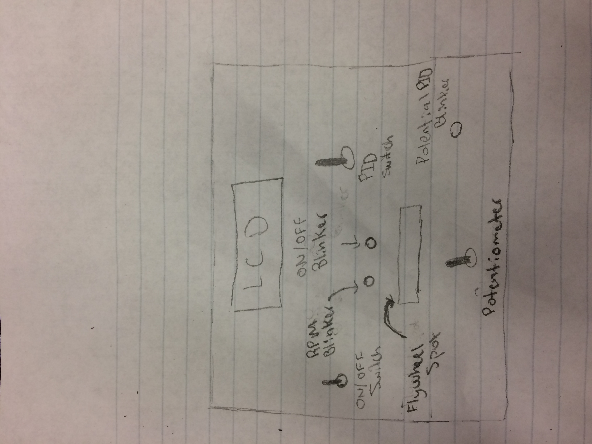
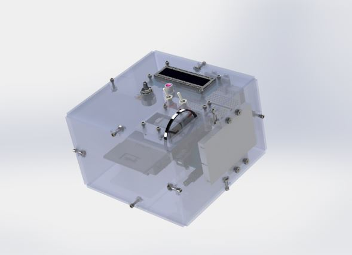

# Motor-Project
Project was creating a box with a cruise-control system for a spinning wheel built in. Completed on May 8th, 2017, in collaboration with Cole Fairchild. Original [wiki page](http://wiki.chssigma.com/index.php?title=Dani_and_Cole%27s_Motor_Project).

# Table of Contents
<!-- TOC -->
- [Motor-Project](#motor-project)
- [Table of Contents](#table-of-contents)
- [Planning](#planning)
  - [Problem/Goal](#problemgoal) 
  - [Materials](#materials)
  - [Timeline](#timeline)
  - [Possible Issues](#possible-issues)
  - [Milestones](#milestones)    
  - [Box Sketch](#box-sketch)
- [Progress](#progress)
  - [Stage 1](#stage-1) 
  - [Stage 2](#stage-2)  
  - [Stage 3](#stage-3)
  - [Stage 4](#stage-4) 
  - [Stage 5](#stage-5) 
  - [Stage 6](#stage-6)  
  - [Stage 7](#stage-7)   
  - [Stage 8](#stage-8)   
  - [Stage 9](#stage-9)    
  - [Stage 10](#stage-10)
- [Finished Product](#finished-product)
  - [Code](#code) 
  - [Solidworks](#solidworks)
  - [Final Product](#final-product)
<!-- /TOC -->
# Planning 
## Problem/Goal
The final project/goal we are trying to accomplish is to create a motor that regulates its rpm like cruise control. The motor and all parts will be encased in a box with an LCD monitor that displays Actual Speed and Input Speed.
## Materials
- Arduino & Breadboard
- Photo interrupter
- Motor
- Two switches with mounts
- Leds
- Acrylic for laser cutting
- Screws
- 3D printed flywheel
## Timeline
**Dec 10 - 16: Research**
- PID Algorithms Designs
- Previous projects

**Jan 4 - 7:**
- Pick functions and outline code

**Jan 8 - 20: Solidworks**
- Initial shape/structure
- Spacing
- Mounts

**Jan 20 - Jan 31: Code**
- PID
- Calculate RPM

**Feb 1 - Feb 4: Integration and Proofing**
- Wiring Arduino
- Printing Parts

**Feb 6 - 15: Assembly and Polish**
## Possible Issues
- Trouble understanding PID
- Not knowing math for algorithm
- Trouble creating mounts
## Milestones
**Milestone 1:**
- Understand PID and RPM and have design chosen.
- Have measurements

**Milestone 2:**
- Create base of box, no cuts yet.

**Milestone 3:**
- Create wheel
- Finish cuts
- Design mounts

**Milestone 4:**
- Finish all code

**Milestone 5:**
- Wire the arduino
- Print Solidworks parts
- Redesign as needed

**Milestone 6:**
- Assemble
- Wire
- Redesign as needed

**Milestone 7:**
- Assemble
- Test

## Box Sketch

  

- [Box Sketch](media/MotorProjectSketch.jpg)
# Progress
### Stage 1
This week we wanted to develop a good understanding of what components will go into our code and the PID algorithm. We read the pseudo-code on the Canvas page, but an obstacle we faced was figuring out why the algorithm worked, and how it would translate into actual code. To figure this out we read the Wikipedia page on PID, which had a very helpful graphic explaining the effects of the constants and tuning. After reading there and a couple of other sites, we had a good idea about how to move on. At the end of the week, we started on the Solidworks modeling.
### Stage 2
After starting the Solidworks last week, we really got going this week. Dani and I split up the different parts we needed, and measured out all our components with the caliper and compared them to their Solidworks models. After measuring everything and looking at some other projects, we decided on a box with 150 x 150 as and a height of 120. We started modeling, each taking different sides, and eventually got the basic box structure to fit.
### Stage 3
This week we continued with Solidworks, making cuts into the sides and starting the accessory components. We used configurations on two different sides to add the cuts for all of the screws, buttons, switches, and displays. In total we made four configurations. This week we also designed the wheel for laser-cutting, deciding on a small, thin design with two spokes. We managed to cut the wheel without a problem, but it was not solid black and it was too loose on the hole.
### Stage 4
This week we finished up on a lot of the Solidworks, finalizing the design and finally cutting all the sides. Realizing that we would probably need a printed mount for the photo interrupter and the motor, I made both in Solidworks and they are in the chemical bath now. With all the physical components ready, we are now about to start on the code. The challenge now is that we know what to do with the algorithm, we actually found a library in Arduino that automatically does the math given inputs, but we also have to input code around it that controls all the switched and displays in the box along-side it. We are currently deciding whether or not to write a function-based program, or write it all in the loop. We are on schedule currently as the Solidworks is done, but looking at the code I honestly don't know when it will be done.
### Stage 5
This week we are starting our code. We outlined it on paper to get an idea of what it will look like, but we are basing the foundations on some sample code that was left on the page of the PID library we found. It has code that looks good, and will be easy to input into a larger program. The obstacle we are faced with now is learning about all the tuning procedures. We are exploring the possibility of having a set of aggressive tuning for when the Input is far away, and then a set of conservative ones for when it's really close. It should just be a simple if statement, but I don't know much about how the tuning will work. At the end of the week, pulling code from some other examples I have put together a rough program that won't work but is a good start. I think we are on schedule.
### Stage 6
This week was really difficult because we are experiencing a lot of issues with our code. In order to do some preliminary troubleshooting, we hooked the code up to a motor, interrupter and a potentiometer, printing data on the Serial Port. This way we could start to see what was being outputted and what was going wrong. I already knew that the code was not done, but we started getting some ridiculous outputs and I couldn't make sense of what was happening. After about a couple of days of trying to adjust code and fix the problems, we ended up with the code looking worse than it was in the first place and not outputting anything at all. Since we made very little progress this week, we are falling behind. Wen need to figure out how the code will will work.
### Stage 7 
For about half the week, we tried to work out the problems with our code but our efforts were in vain. So, we decided to build off of the code we wrote for motor control in the earlier projects. By basing it off the earlier code, and adding different parts piece by piece we were able to effectively finish the code so that it worked in a couple of days. Sadly though, you told us we weren't allowed to use our PID library, so we had to shift a little bit. The challenges we are facing now are the tuning for the PID and wiring. We are behind schedule due to the problems with the code, but I feel now we are in the clear.
### Stage 8
This week we made a lot of progress on the box. Dr. Shields helped us realize a small problem with the wiring: we had wired the photo interrupter backwards. After that we fixed the tuning, and everything was working. By Thursday we had everything working out of the breadboard, but we needed to now pit everything in the box. Friday we started screwing in and we took everything out of the breadboard so we could mount it on the box. We are on schedule post the code issues, but the only challenge we will have is putting the box together exactly the same way as it was before.
### Stage 9
This week we are putting together the box, and it is taking a little longer than expected. We soldered the led, potentiometer, motor, and switches so they would be ready for implementation. At this time everything is screwed in except for the Arduino, and the wiring is half done. The only challenge is making sure it works at the end and all the wiring is correct. We are slightly behind schedule, but I predict we will finish in the next two weeks.
### Stage 10
This week we finally finished! After solving some issues with the PID, switch wiring, and LED coding, we finally were able to put the box together before anything else broke. The final step that seemed to fix all of our problems was in the code. By taking out everything except the PID math out of the if statement, we were able to control the motor with and without the algorithm. We uploaded pictures and the code to the wiki, and everything is done.
# Finished Product
## Code
- [code](code/motorProject.ino)
## Solidworks

  

- [Demo](media/full_box.jpg)
- [Top View](media/top_view.jpg)
- [Isometric View](media/isometric_view.jpg)
## Final Product

  

- [Demo Gif](media/Motorpgif.gif)
- [Top View](media/final_p_top.jpg)
- [Isometric View](media/final_p_iso.jpg)
